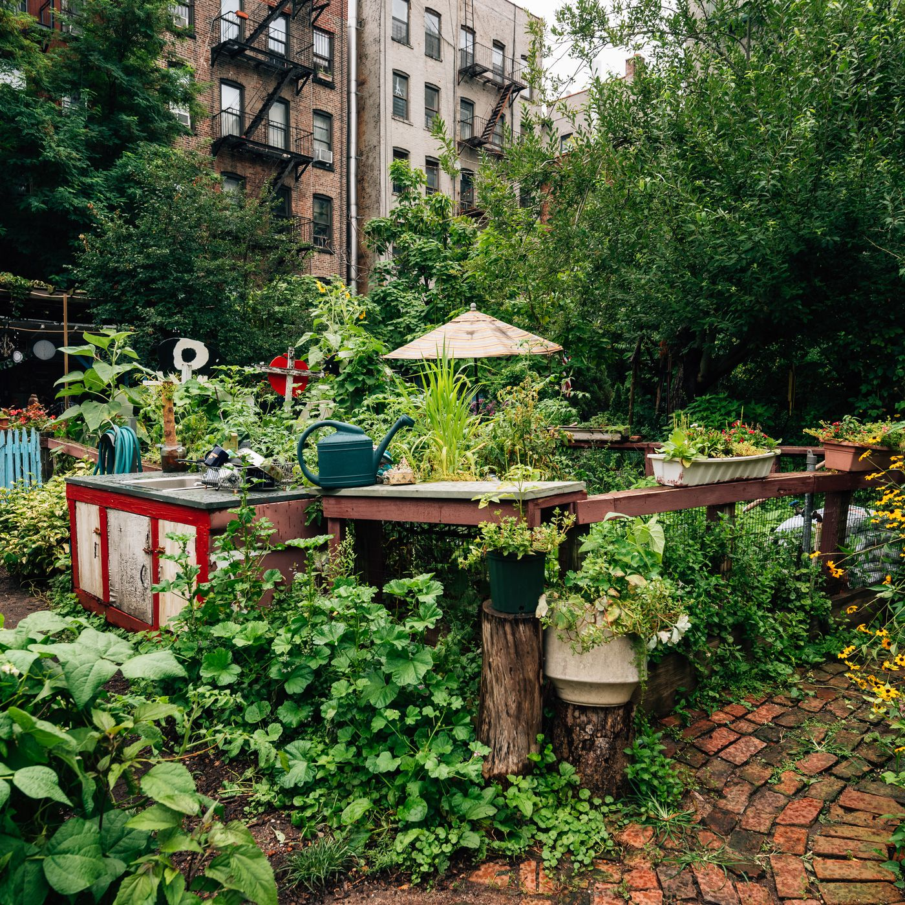

<h6 style="text-align: center;" markdown="1">By: Sushupta Vijapur  ||  Kelley Lou ||  Isabel Nelson </h6>

{ height="300px" width="400px" }  { height="300px" width="400px" } 

Images from [Curbed NY](https://ny.curbed.com/2019/10/7/20887684/nyc-agriculture-urban-farming-community-gardens)

#### Project Motivation

With its reputation as the "concrete jungle," New York City is known for its towering skyscrapers and bustling streets. However it also has a long and vibrant history of urban agriculture and green space cultivation. After the economic crisis and disinvestment in the 1970s, many areas of the city saw a surge in abandoned buildings and vacant lots that were turned over to the city through foreclosure. The activist group Green Guerillas saw the opportunity to reinvest in their neighborhood and reclaim these lots as green spaces for the community. This grew into a larger movement of community gardeners, with the city leasing lots to community gardens and providing support through the creation of the GreenThumb program in 1978. Despite the gardens' successes as important cultural and community institutions, there was continual pressure from the city to turn gardens into housing developments. Over the years, community members and organizations have come together to fight for, preserve, and develop new gardens for the wider community despite these pressures. 

***

#### About the Gardens 

There are now over 500 community gardens throughout New York City. These gardens provide a sense of ownership and stability in the rapidly changing city. They offer residents a calm escape, a space to come together with community members to solve local problems, and a connection to local food production. In addition to the value they bring to individuals, community gardens have embedded themselves in the fabric of New York City neighborhoods and have impacted areas as diverse as property values, community activism, and health. 

***

#### What you'll find here

This project aims to further explore the relationship between community gardens and the people and fabric of NYC neighborhoods by asking four main questions: 

1. How are [community gardens](main.html) distributed throughout the city?
2. How are the locations of gardens related to certain [demographic characteristics](main.html)? 
3. What is the relationship between community gardens and [economic investment](property_values.html)? 
4. What is the relationship between community gardens and select [health conditions](health.html)? 

***

#### How to Get Involved

Find your closest neighborhood garden [here](main.html) and check out existing gardens. Visit them during their open hours and public event postings. Introduce yourself to gardeners and ask about getting involved. Each garden is unique in their operations and may have difference processes to volunteer, obtaining a bed, etc. 

You can also call NYC GreenThumb's office at (212) 602-5300 or [email](greenthumbinfo@parks.nyc.gov) for more information.

***

The final project report can be found [here](report.html).

<html>
  
&nbsp;

<small>
  

  Sushupta Vijapur (smv2138)  ||  Kelley Lou (kl3181)  ||  Isabel Nelson (isn2102)

2020

</small>

</html>
