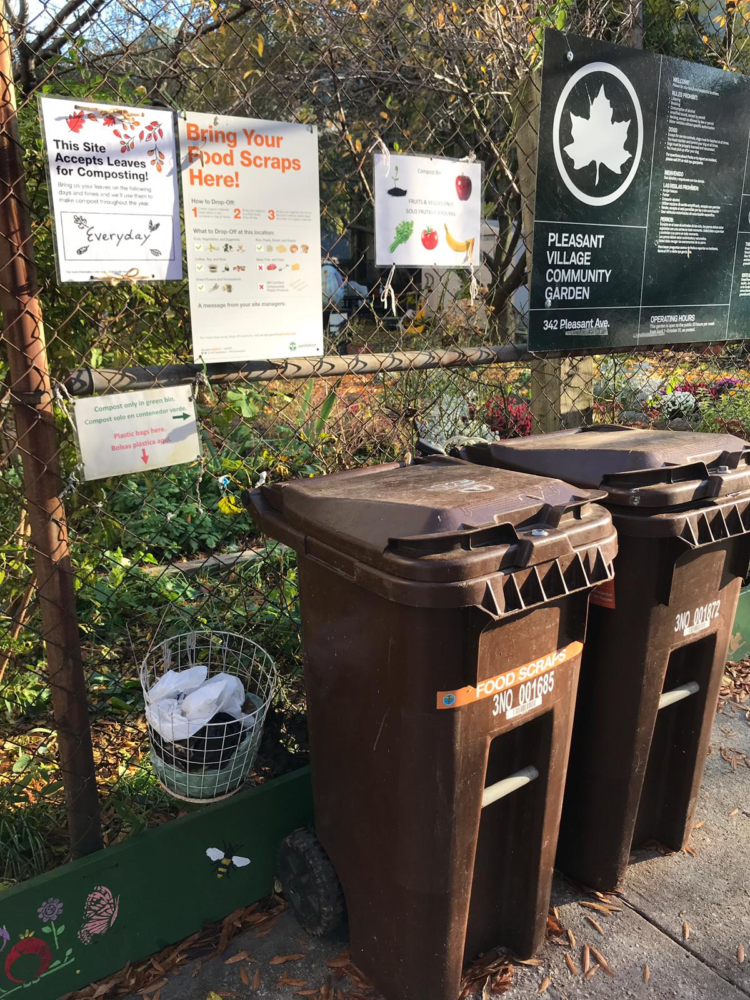

```{r setup, include=FALSE}

library(tidyverse)
library(readxl)
library(plotly)
library(leaflet)
library(rgdal)
library(sp)
library(reactable)
library(plotly)
library(magrittr)
library(sandwich)
library(spdep)
library(maptools)
library(spatialreg)
library(patchwork)
library(modelr)
library(tmap)
library(kableExtra)
library(patchwork)

#Set global theme for plots
theme_set(theme_minimal() + 
            theme(legend.position = "bottom", 
                  axis.text.x = element_text(angle = 90, vjust = 0.5, hjust = 1)))
#Set options for all plots
options(
  ggplot2.continuous.colour = "viridis",
  ggplot2.continuous.fill = "viridis"
)
scale_colour_discrete = scale_colour_viridis_d
scale_fill_discrete = scale_fill_viridis_d

set.seed(1)
```


<style type="text/css">

h1.title {
  text-align: center;
}

</style>


<center>
{ height="267px" width="200px" }  { height="267px" width="200px" } 
</center>
<center>Images taken by *Isabel Nelson* and *Kelley Lou*</center>


## Motivation

* Since the development of community gardens in NYC beginning in the 1970s, these small pockets of green space have become staples of the city's urban landscape.  
* Research in the past decade has begun to explore the connection between urban green space and various health outcomes.  
* We wanted to better understand the relationship of community gardens to demographic characteristics, health outcomes, and economic conditions in NYC neighborhoods.   

***

### **Background and Related Work**

The inspiration for this project stemmed from our own individual interests in green spaces in New York City and passions for gardening. We volunteer at community gardens, grow our own food, and have gained a better understanding of the neighborhoods that we have joined since starting at Columbia. This spurred us to want to further explore how these gardens interact with other aspects of health and humanity in New York City. 

The following resources further inspired our motivation and guided our hypothesis generation for this project:

1. [History of NYC garden movement](https://www.nycgovparks.org/about/history/community-gardens/movement)
2. [The Green Guerillas](http://www.greenguerillas.org/history)
3. [New York City Community Garden Coalition](https://nyccgc.org/about/history/)
4. [Gardens and the politics of scale](https://www.jstor.org/stable/30033906)
5. [Conflicting rights to the city in gardens](https://www.jstor.org/stable/41147766)
6. [Community gardens and community activism](https://www.pps.org/article/beyond-food-community-gardens-as-places-of-connection-and-empowerment)  
7. [Urban green space and health](https://www.ncbi.nlm.nih.gov/pmc/articles/PMC2566234/pdf/587.pdf)  
8. [Obesity and green space](https://doi.org/10.1093/eurpub/ckx037)  
9. [Community gardening and communal resilience](https://doi.org/10.3390/ijerph17186740)  
10. [Neighborhood perceptions and hypertension](https://doi.org/10.1186/s12889-016-3741-2)  

***

## Questions

Our initial broad question was to explore how gardens were distributed throughout the city and how these gardens affect the people in each community. As we moved through the project, we narrowed our focus to the four main areas of inquiry below. We further narrowed our questions as we explored our chosen datasets.  

1. How are community gardens distributed throughout the city?
2. How are the locations of gardens related to certain demographic characteristics?
3. What is the relationship between community gardens and economic investment? 
4. What is the relationship between community gardens and health conditions? 

***

## Data

### *Data Sources*

* Primary data source: [NYC Greenthumb Community Gardens](https://data.cityofnewyork.us/Environment/NYC-Greenthumb-Community-Gardens/ajxm-kzmj)
* Demographic & health data from [nyc.gov](https://communityprofiles.planning.nyc.gov/)
* Property value data from [Revised property value notices](https://data.cityofnewyork.us/City-Government/Revised-Notice-of-Property-Value-RNOPV-/8vgb-zm6e)
* Participatory budgeting project tracker from [NYC OpenData](https://data.cityofnewyork.us/City-Government/Participatory-Budgeting-Project-Tracker/qm5f-frjb)

### *Data Cleaning*

Each dataset that was obtained was first individually cleaned. Most were already well organized, and unnecessary variables were removed for efficiency and clarity. Average variables for market value and budget allocation were calculated in these steps as well.

```{r, message = FALSE, warning = FALSE}

# Cleaning and tidying primary NYC garden data
gardens = 
  read_csv("./data/nyc_community_gardens.csv") %>% 
  janitor::clean_names() %>% 
  mutate(
    community_board = replace(community_board, community_board == "N/A", NA)
  ) %>% 
  drop_na(community_board) %>% 
  relocate(community_board) %>% 
  select(-prop_id,-census_tract, -bin, -bbl, -nta, -council_district, -cross_streets, -jurisdiction, -postcode)

# Cleaning and tidying demographic data
demo = 
  read_xlsx("./data/health_profiles.xlsx",
  sheet = "CHP_all_data", skip = 1) %>% 
  janitor::clean_names() %>% 
  slice(-(1:6)) %>% 
  slice_head(n = 59) %>% 
  mutate(
    id_spatial = id, 
    id = str_replace(id, "^1", "M"),
    id = str_replace(id, "^2", "X"),
    id = str_replace(id, "^3", "B"),
    id = str_replace(id, "^4", "Q"),
    id = str_replace(id, "^5", "R"),
    gentrification = replace(gentrification, gentrification == "n/a", NA),
    avertable_death = replace(avertable_death, avertable_death == "n/a", NA),
    avertable_death = replace(avertable_death, avertable_death == "^", NA)
  ) %>% 
  rename(community_board = id, not_complete_hs = edu_did_not_complete_hs, hs_some_college = edu_hs_grad_some_college, college_higher = edu_college_degree_and_higher) %>% 
  select(id_spatial, community_board:age65plus, on_time_hs_grad, not_complete_hs, hs_some_college, college_higher, poverty, rent_burden, obesity, hypertension, life_expectancy, self_rep_health)

# Cleaning and tidying property data
property = 
  read_csv("./data/property_values.csv") %>% 
  janitor::clean_names() %>% drop_na(community_board) %>% 
  rename(old_community_board = community_board) %>% 
  mutate(
    boro_letter = case_when(
      borough == "MANHATTAN" ~ "M",
      borough == "BRONX" ~ "X",
      borough == "BROOKLYN" ~ "B",
      borough == "QUEENS" ~ "Q",
      borough == "STATEN IS" ~ "R"
    ),
    board_num = ifelse(nchar(old_community_board) == 1, paste0(0, old_community_board), old_community_board)
  ) %>% 
  unite("community_board", boro_letter, board_num, sep = "") %>% 
  relocate(community_board, old_community_board, borough) %>% 
  select(community_board, original_market_value, revised_market_value)

# Grouping property data by community board to prepare for merging.
property_tidy = 
  property %>% 
  group_by(community_board) %>% 
  summarize(
    avg_org_value = mean(original_market_value, na.rm = TRUE),
    avg_rev_value = mean(revised_market_value, na.rm = TRUE)
  )

# Cleaning and tidying budget data
budget = 
  read_csv("./data/budget_tracker.csv") %>% 
  janitor::clean_names() %>% drop_na(community_board) %>% 
  rename(old_community_board = community_board) %>% 
  mutate(
    boro_letter = case_when(
      borough == "MANHATTAN" ~ "M",
      borough == "BRONX" ~ "X",
      borough == "BROOKLYN" ~ "B",
      borough == "QUEENS" ~ "Q",
      borough == "STATEN IS" ~ "R"
    ),
    board_num = ifelse(nchar(old_community_board) == 1, paste0(0, old_community_board), old_community_board)
  ) %>% 
  unite("community_board", boro_letter, board_num, sep = "") %>% 
  relocate(community_board, old_community_board, borough) %>% 
  select(community_board, vote_year, total_appropriated)

# Grouping budget data by community board to prepare for merging and calculating the average budgets for each community board.
budget_tidy = 
  budget %>% 
  group_by(community_board) %>% 
  summarize(
    avg_tot_appropriated = mean(total_appropriated, na.rm = TRUE)
  )
```

Afterwards, we merged all datasets into two tidied datasets. The first contains one row for each unique community districts with a variable for the number of community gardens per district, and the second contains one row for each unique community garden. 

```{r, message = FALSE, warning = FALSE}

final_tidy1 =
  left_join(demo, gardens, by = "community_board") %>% 
  left_join(., property_tidy, by = "community_board") %>% 
  left_join(., budget_tidy, by = "community_board")

# Calculating number of gardens in each community board
num_gardens <-
  final_tidy1 %>% 
  drop_na(garden_name) %>% 
  group_by(community_board) %>% 
  summarize(garden_num = n())

unique_comboard <-
  final_tidy1 %>% 
  distinct(community_board, .keep_all = TRUE)

# Complete merging
final_tidy <-
  left_join(unique_comboard, num_gardens, by = "community_board") %>% 
  replace_na(list(garden_num = 0)) 

final_extra <-
  left_join(final_tidy1, num_gardens, by = "community_board") %>% 
  replace_na(list(garden_num = 0))

write_csv(final_tidy, "./data/final_df.csv")
write_csv(final_tidy1, "./data/final_df_main.csv")
```

The first tidied dataset contains 59 observations (the number of community boards in NYC) and consists of the following 36 variables:

  * `id_spatial`. Unique spatial ID for each board.
  * `community_board`. Community board location of each garden.
  * `borough`. Borough location of each community board.
  * `name`. Neighborhood name location of each community board.
  * `overall_pop`. Overall population number in each community board.
  * `race_white`. Percent self-reporting non-hispanic white.
  * `race_black`. Percent self-reporting non-hispanic black.
  * `race_asian`. Percent self-reporting non-hispanic asian.
  * `race_latino`. Percent self-reporting hispanic/latino.
  * `race_other`. Percent self-reporting other (American Indian, Native Hawaiian, Pacific Islander, two or more races).
  * `age0to17`. Percent age between 0 and 17 years.
  * `age18to24`. Percent age between 18 and 24 years.
  * `age25to44`. Percent age between 25 and 44 years.
  * `age45to64`. Percent age between 45 and 64 years.
  * `age65plus`. Percent age 65 years and older.
  * `on_time_hs_grad`. Percentage of public high school freshman from the 2013-2014 school year who graduated in 4 years 
  * `not_complete_hs`. Percentage of adults ages 25 and older whose highest level of education is less than a high school diploma or GED.
  * `hs_some_college`. Percentage of adults ages 25 and older who have a high school diploma or a high school diploma and some college.
  * `college_higher`. Percentage of adults ages 25 and older who obtained an educational degree above a High School diploma (Associate’s, Bachelor’s, or Graduate or professional degree).
  * `poverty`. Percentage of residents living below 100% of New York City’s calculated poverty threshold based on income and necessary expenses.
  * `rent_burden`. Percentage of renter-occupied homes whose gross rent (contract rent plus estimated average monthly cost of utilities including electricity, gas, and water and sewer) is equal to or greater than 30 percent of household income in past 12 months.
  * `obesity`. Percentage of adults ages 18 and older who have obesity (Body Mass Index of 30 or greater) based on self-reported height and weight.
  * `hypertension`. Percentage of adults ages 18 and older who report ever being told by a healthcare professional that they have hypertension, also known as high blood pressure.
  * `life_expectancy`. Life expectancy at birth.
  * `self_rep_health`. Percentage of adults ages 18 and older who report their overall health is “excellent,” "very good" or “good” on a scale of excellent, very good, good, fair or poor.
  * `boro`. Borough location of each community board.
  * `garden_name`. Name of garden.
  * `address`. Address of garden.
  * `size`. Size of garden in acres.
  * `neighborhood_name`. Neighborhood name location of each community board
  * `latitude`. Latitude location of garden.
  * `longitude`. Longitude location of garden.
  * `avg_org_value`. Average original market value of a property.
  * `avg_rev_value`. Average revised market value of a property.
  * `avg_tot_appropriated`. Average total amount of funding for projects allocated by participatory budgeting in a community board.
  * `garden_num`. Number of gardens in each community board.
  
The second tidied dataset contains 535 rows (the number of unique community gardens).

***

## Analytic and visualization strategy

To begin answering our project questions, we first [visualized the distribution of community gardens](main.html) throughout the city. We wanted to see if the locations of community gardens are equally distributed throughout New York City.

### **Garden Distribution**

To explore this distribution, we created a leaflet map showing each garden as well as the outline of each community board. The labels for each community district have the total number of gardens in that district.  

```{r, message = FALSE, warning = FALSE}

# Read in tidied dataset.
garden =
  read_csv("./data/final_df.csv") %>%
  group_by(community_board) %>%
  select(id_spatial, garden_num, community_board, borough, overall_pop, race_white:college_higher, garden_name:longitude)

garden_all = 
  read_csv("./data/final_df_main.csv")

# Create leaf icons for leaflet map.
leafIcons <- icons(
  iconUrl = "http://leafletjs.com/examples/custom-icons/leaf-green.png",
  iconWidth = 10, iconHeight = 20
)

# Prepare for leaflet outline.
working <- getwd()
com_board_spdf <- readOGR(dsn = working, layer = "community_board_new", verbose = FALSE)
invisible(names(com_board_spdf))
data_spatial <- merge(com_board_spdf, garden, by.x = "boro_cd", by.y = "id_spatial")

# Add popup labels for map.
garden_all = 
  garden_all %>%
     mutate(
      click_label =
        str_c("<b>", garden_name, "</b><br>", borough, "</b><br>", size, " acres"))

# Prepare the text for labels:
mytext <- paste(
    "Borough: ", data_spatial@data$borough,"<br/>",
    "Community Board: ", data_spatial@data$community_board,"<br/>", 
    "Number of Gardens: ", data_spatial@data$garden_num, "<br/>", 
    sep = "") %>%
  lapply(htmltools::HTML)
 
# Final Map with shaded colors by number of gardens in the community district
leaflet() %>% 
  addProviderTiles(providers$CartoDB.Positron) %>%  
  setView( lat = 40.7, lng = -74 , zoom = 10) %>%
  addPolygons(data = data_spatial,
    fillOpacity = 0, 
    smoothFactor = 0.5, 
    stroke = TRUE, 
    color = "black", 
    weight = 1,
    label = mytext,
    labelOptions = labelOptions( 
      style = list("font-weight" = "normal", padding = "3px 8px"), 
      textsize = "13px", 
      direction = "auto"
    )
  ) %>% 
    addMarkers(data = garden_all, ~longitude, ~latitude, icon = leafIcons, popup = ~click_label)
```

To better visualize the number of gardens in each community district we also created a bar graph.

```{r, echo = FALSE, message = FALSE, warning = FALSE}
# Selecting necessary columns from main dataset
garden =
  read_csv("./data/final_df_main.csv") %>%
  group_by(community_board) %>%
  select(community_board, borough, overall_pop, race_white:college_higher, garden_name:longitude)

# Calculating the number of gardens
garden_num = 
  garden %>% 
  drop_na(garden_name) %>% 
  group_by(community_board) %>% 
  summarize(garden_num = n())

# Joining number of gardens with dataset 
garden_tidy = 
  left_join(garden, garden_num, by = "community_board")

number_borough = 
  garden_tidy %>% 
  select(community_board, garden_num, borough) %>% 
  distinct() %>% 
  mutate(
    community_board = as.factor(community_board)
  )

number_borough[is.na(number_borough)] <- 0 

# Creating plot 
number_borough %>%
  mutate(text_label = str_c("Number of Gardens: ", garden_num, "\nBorough: ", borough)
         ) %>% 
    plot_ly(
      x = ~community_board, y = ~garden_num, text = ~text_label, color = ~borough, 
      type = "bar", colors = "viridis"
            ) %>% 
        layout(autosize = F, width = 900, xaxis = list(
          title = "Community Board", tickmode = "linear"), yaxis = list(title = "Number of Community Gardens", dtick = 5))
```

We then created tables showing an overview of demographic information which allows the reader to gain a better understanding of differences between community districts.

#### **Age Distribution**

```{r, message = FALSE, warning = FALSE}
# Creating age tables
age_tables =
  garden_all %>% 
  select(borough, community_board, age0to17:age65plus) %>% 
  distinct()

# Formatting column names
colnames(age_tables) = c("Borough", "Community Board", "0 to 17 years", "18 to 24 years", "25 to 44 years", "45 to 64 years", "65 plus")

# Interactive table including averages
reactable(age_tables, groupBy = "Borough",highlight = TRUE, searchable = TRUE, striped = FALSE, fullWidth = FALSE, showSortIcon = FALSE, 
          theme = reactableTheme(
    borderColor = "#89C281",
    highlightColor = "#C0DCBC"), 
    defaultColDef = colDef(
      align = "left",
      minWidth = 100),
    columns = list(
  'Community Board' = colDef(),
  "0 to 17 years" = colDef(aggregate = "mean", format = colFormat(digits = 2, suffix = "%")),
  "18 to 24 years" = colDef(aggregate = "mean", format = colFormat(digits = 2, suffix = "%")),
  "25 to 44 years" = colDef(aggregate = "mean", format = colFormat(digits = 2, suffix = "%")),
  "45 to 64 years" = colDef(aggregate = "mean", format = colFormat(digits = 2, suffix = "%")),
  "65 plus" = colDef(aggregate = "mean", format = colFormat(digits = 2, suffix = "%"))))

```

#### **Education Distribution**

```{r, message = FALSE, warning = FALSE}
# Creating education table
edu_tables =
  garden_all %>% 
  select(borough, community_board, on_time_hs_grad:college_higher) %>% 
  distinct()

# Additional order formatting
edu_tables = 
  edu_tables %>% 
 relocate(not_complete_hs, .after = community_board)

# Creating column names
colnames(edu_tables) = c("Borough", "Community Board", "Less than High School", "High School", "Some College", "College or higher")

# Creating interactive table and averages
reactable(edu_tables, groupBy = "Borough", highlight = TRUE, searchable = TRUE, striped = FALSE, fullWidth = FALSE, showSortIcon = FALSE,
          theme = reactableTheme(
    borderColor = "#89C281",
    highlightColor = "#C0DCBC"), defaultColDef = colDef(
      align = "left",
      minWidth = 100),
    columns = list(
  'Community Board' = colDef(),
  "Less than High School" = colDef(aggregate = "mean", format = colFormat(digits = 2, suffix = "%")),
  "High School" = colDef(aggregate = "mean", format = colFormat(digits = 2, suffix = "%")),
  "Some College" = colDef(aggregate = "mean", format = colFormat(digits = 2, suffix = "%")),
  "College or higher" = colDef(aggregate = "mean", format = colFormat(digits = 2, suffix = "%"))))
```

#### **Race Distribution**

```{r, message = FALSE, warning = FALSE}
# Creating race table
race_tables =
  garden_all %>% 
  select(borough, community_board, race_white:race_other) %>% 
  distinct()

# Formatting column names
colnames(race_tables) = c("Borough", "Community Board", "White", "Black", "Asian", "Latino", "Other")

# Creating interactive table and averages
reactable(race_tables, highlight = TRUE, searchable = TRUE, striped = FALSE, fullWidth = FALSE, showSortIcon = FALSE, 
          theme = reactableTheme(
    borderColor = "#89C281",
    highlightColor = "#C0DCBC"),
          groupBy = "Borough", defaultColDef = colDef(
      align = "left",
      minWidth = 100),
    columns = list(
  "Community Board" = colDef(),
  White = colDef(aggregate = "mean", format = colFormat(digits = 2, suffix = "%")),
  Black = colDef(aggregate = "mean", format = colFormat(digits = 2, suffix = "%")),
  Asian = colDef(aggregate = "mean", format = colFormat(digits = 2, suffix = "%")),
  Latino = colDef(aggregate = "mean", format = colFormat(digits = 2, suffix = "%")),
  Other = colDef(aggregate = "mean", format = colFormat(digits = 2, suffix = "%"))))
```

The garden map illustrates that there are many gardens distributed around the city, however they do not seem to be evenly spaced. There appear to be more gardens in north Brooklyn, south / west Queens, the lower east side, northern Manhattan and the Bronx. 

The age table shows that the distribution in age across the five boroughs are similar, with the majority of people being 25 to 44 years old. However, there seems to be less children living in Manhattan when compared to the other boroughs. In terms of education, there is a larger difference. It appears that most people living in New York City have a high school education, with percentages tapering quickly moving towards college. Manhattan has the highest percentage of a college education or higher (65%), which is much higher than all other boroughs, more than doubling the percentage in the Bronx. Race also appears to be highly divided. While the majority of people in Staten Island are white, the majority of people in the Bronx are Latino. Manhattan looks to be most evenly distributed, showing the difference in racial makeup for each geographical location.

After looking at the distribution of gardens we wanted to test if the spatial distribution was randomly distributed using a statistical test. To do this we used Moran's I, which is similar to a correlation coefficient and denotes the level of correlation between values in a certain area and the values in the surrounding areas. We first created a queen's neighborhood spatial weight matrix to define spatial neighbors as those community districts directly touching each other, and used this to calculate Moran's I using the spdep package. 

A significant Moran's I indicates the values are significantly clustered in space and are not randomly distributed. We found that the Moran's I for garden number was 0.19, with a p-value of 0.014, confirming our visual suspicion that community gardens in NYC are not evenly distributed spatially.

```{r, message = FALSE, warning = FALSE}
analysis_data_final <-
  read_csv("./data/final_df.csv") %>% 
  select(id_spatial, community_board, obesity, hypertension, life_expectancy, self_rep_health, poverty, avg_rev_value, avg_tot_appropriated, borough, garden_num) %>% 
filter(!id_spatial %in% c('414'))
         
working <- getwd()
com_board_spdf <- readOGR(dsn = working, layer = "community_board_new", verbose = FALSE)
com_board_spdf2 <- com_board_spdf[!com_board_spdf@data$boro_cd %in% c("414"), ]
invisible(names(com_board_spdf))
analysis_data_spatial <- merge(com_board_spdf2, analysis_data_final, by.x = "boro_cd", by.y = "id_spatial")

###Create a queen's neighborhood weight matrix using the poly2nb command.
analysis_nbq <- poly2nb(analysis_data_spatial)

###extract coordinates to plot the connectivity matrix for visualization.
coords <- coordinates(analysis_data_spatial)

###convert the neighborhood matrix into a list so that the connections between counties can be used in Moran's I test.
analysis_nbq_w <- nb2listw(analysis_nbq)

###Garden number
###Convert Exposure variable to z-form and then create the lag of that variable.
analysis_data_spatial@data$garden_num <- scale(analysis_data_spatial@data$garden_num)
analysis_data_spatial@data$lag_sQL <- lag.listw(analysis_nbq_w,analysis_data_spatial@data$garden_num)

### Lose spatial properties when we turn into data frame for analysis
#analysis_sp_data <- as.data.frame(analysis_data_spatial)

###Run morans I test and plot the results.
garden_moran <- moran.test(analysis_data_spatial@data$garden_num, listw = analysis_nbq_w, zero.policy = TRUE)
moran.plot(as.vector(analysis_data_spatial@data$garden_num), listw = analysis_nbq_w, 
           xlim = c(-2,4),ylim = c(-2,2),
                 main = "Moran's I = 0.1899, p-value = 0.0138", 
           xlab = "Garden Number", ylab = "Spatial Lag Number of Gardens", pch = 19)
```

This information serves as a foundation for the other analyses to build off of. 

***

### **Relationship of Garden Number to Economic and Health Outcomes**

The next step in our exploration was to see how the number of gardens in each community district was related to health and economic outcomes. To do this we decided to build regression models using the number of gardens in each community district as the main predictor of interest. We began the process by selecting specific outcome variables that we hypothesized might be influenced by the number of gardens in a community district, informed by prior literature. The studies and articles we reviewed (see Background and Related Work section of the report) suggested that access to green space and gardens was beneficial for health, and that community gardens may also positively impact community engagement and the perceived value of the neighborhood. 

We initially selected the following variables as outcomes to explore with linear regression:   

**Health outcomes**  
1. Obesity

  - Hypothesis: A higher number of community gardens in a district will be associated with a lower percentage of obese adults in the district.   
2. Hypertension

  - Hypothesis: A higher number of community gardens in a district will be associated with a lower percentage of adults reporting hypertension in the district.   
3. Life expectancy

  -Hypothesis: A higher number of community gardens in a district will be associated with a higher average life expectancy in the district.   
4. Self-reported health  

  -Hypothesis: A higher number of community gardens in a district will be associated with a higher percentage of adults in the district reporting good health.   

**Economic outcomes**  
1. Money allocated to project through a participatory budgeting process 

  -Hypothesis: A higher number of community gardens in a district will be associated with greater total amount of money allocated by the community through participatory budgeting processes for that district.  
2. Average market value of buildings

  -Hypothesis: A higher number of community gardens in a district will be associated with higher average property market values.   
  
**Confounders**   
Given that community gardens were historically formed in empty lots that resulted from abandoned buildings and that poverty also impacts health and perceived neighborhood value, we hypothesized that percent poverty in the neighborhood would be a confounder of all the above relationships. 

Once we selected our variables of interest and formulated our hypotheses, we did some initial visual explorations to better understand our data. The dashboard for *Health conditions* provides a visual comparing number of gardens to percent obesity, hypertension, life expectancy, and self reported health. The dashboard for *Economic investment* shows a visual comparison between budget allocated to each board and market value, poverty percent and rent burden percent.

### **Health Conditions Dashboard**

To visualize the spatial distribution of number of gardens and our [health outcomes](health.html) of interest (hypertension, obesity, life expectancy, and self-reported health) we used leaflet to create choropleths that colored each community district by quintile of value for the variable of interest.

```{r, message = FALSE, warning = FALSE}
# Creating subset of tidied data for health exploration
health_data_final <-
  read_csv("./data/final_df.csv") %>% 
  select(community_board, borough, obesity, hypertension, life_expectancy, self_rep_health, garden_num, id_spatial) 

working <- getwd()
com_board_spdf <- readOGR(dsn = working, layer = "community_board_new", verbose = FALSE)
invisible(names(com_board_spdf))
health_data_spatial <- merge(com_board_spdf, health_data_final, by.x = "boro_cd", by.y = "id_spatial")

# Create a color palette for the obesity map:
pal2 <- colorNumeric("BuPu", health_data_spatial@data$obesity)

# Prepare the text for obesity labels:
mytext2 <- paste(
  "Borough: ", health_data_spatial@data$borough,"<br/>",
    "Community Board: ", health_data_spatial@data$community_board,"<br/>", 
    "Percent Obesity: ", health_data_spatial@data$obesity, "<br/>", 
    "Number of Gardens: ", health_data_spatial@data$garden_num, "<br/>",
    sep = "") %>%
  lapply(htmltools::HTML)
 
# Final Map with shaded colors by percent obesity in the community district
leaflet(health_data_spatial) %>% 
  addProviderTiles(providers$CartoDB.Positron) %>%  
  setView( lat = 40.7, lng = -74 , zoom = 10) %>%
  addPolygons( 
    fillOpacity = 0.8, 
    smoothFactor = 0.5, 
    fillColor = ~colorQuantile("BuPu", obesity)(obesity), 
    stroke = TRUE, 
    color = "black", 
    weight = 0.3,
    label = mytext2,
    labelOptions = labelOptions( 
      style = list("font-weight" = "normal", padding = "3px 8px"), 
      textsize = "13px", 
      direction = "auto"
    )
  ) %>%
  addLegend( pal = pal2, values = ~obesity, opacity = 0.9, title = "Percent Obesity", position = "topleft" )

# Create a color palette for the hypertension map:
pal3 <- colorNumeric("BuPu", health_data_spatial@data$hypertension)

# Prepare the text for hypertension labels:
mytext3 <- paste(
    "Borough: ", health_data_spatial@data$borough,"<br/>",
    "Community Board: ", health_data_spatial@data$community_board,"<br/>", 
    "Percent Hypertension: ", health_data_spatial@data$hypertension, "<br/>", 
    "Number of Gardens: ", health_data_spatial@data$garden_num, "<br/>",
    sep = "") %>%
  lapply(htmltools::HTML)
 
# Final Map with shaded colors by percent hypertension in the community district
leaflet(health_data_spatial) %>% 
  addProviderTiles(providers$CartoDB.Positron) %>%  
  setView( lat = 40.7, lng = -74 , zoom = 10) %>%
  addPolygons( 
    fillOpacity = 0.8, 
    smoothFactor = 0.5, 
    fillColor = ~colorQuantile("BuPu", hypertension)(hypertension), 
    stroke = TRUE, 
    color = "black", 
    weight = 0.3,
    label = mytext3,
    labelOptions = labelOptions( 
      style = list("font-weight" = "normal", padding = "3px 8px"), 
      textsize = "13px", 
      direction = "auto"
    )
  ) %>%
  addLegend( pal = pal3, values = ~hypertension, opacity = 0.9, title = "Percent Hypertension", position = "topleft" )

# Create a color palette for the life expectancy map:
pal4 <- colorNumeric("BuPu", health_data_spatial@data$life_expectancy)

# Prepare the text for life expectancy labels:
mytext4 <- paste(
    "Borough: ", health_data_spatial@data$borough,"<br/>",
    "Community Board: ", health_data_spatial@data$community_board,"<br/>", 
    "Life Expectancy: ", health_data_spatial@data$life_expectancy, "<br/>", 
    "Number of Gardens: ", health_data_spatial@data$garden_num, "<br/>",
    sep = "") %>%
  lapply(htmltools::HTML)
 
# Final Map with shaded colors by life expectancy in the community district
leaflet(health_data_spatial) %>% 
  addProviderTiles(providers$CartoDB.Positron) %>%  
  setView( lat = 40.7, lng = -74 , zoom = 10) %>%
  addPolygons( 
    fillOpacity = 0.8, 
    smoothFactor = 0.5, 
    fillColor = ~colorQuantile("BuPu", life_expectancy)(life_expectancy), 
    stroke = TRUE, 
    color = "black", 
    weight = 0.3,
    label = mytext4,
    labelOptions = labelOptions( 
      style = list("font-weight" = "normal", padding = "3px 8px"), 
      textsize = "13px", 
      direction = "auto"
    )
  ) %>%
  addLegend( pal = pal4, values = ~life_expectancy, opacity = 0.9, title = "Life Expectancy", position = "topleft" )

# Create a color palette for the self reported health map:
pal5 <- colorNumeric("BuPu", health_data_spatial@data$self_rep_health)

# Prepare the text for self reported health labels:
mytext5 <- paste(
    "Borough: ", health_data_spatial@data$borough,"<br/>",
    "Community Board: ", health_data_spatial@data$community_board,"<br/>", 
    "Self Reported Health: ", health_data_spatial@data$self_rep_health, "<br/>",
    "Number of Gardens: ", health_data_spatial@data$garden_num, "<br/>",
    sep = "") %>%
  lapply(htmltools::HTML)
 
# Final Map with shaded colors by self reported health in the community district
leaflet(health_data_spatial) %>% 
  addProviderTiles(providers$CartoDB.Positron) %>%  
  setView( lat = 40.7, lng = -74 , zoom = 10) %>%
  addPolygons( 
    fillOpacity = 0.8, 
    smoothFactor = 0.5, 
    fillColor = ~colorQuantile("BuPu", self_rep_health)(self_rep_health), 
    stroke = TRUE, 
    color = "black", 
    weight = 0.3,
    label = mytext5,
    labelOptions = labelOptions( 
      style = list("font-weight" = "normal", padding = "3px 8px"), 
      textsize = "13px", 
      direction = "auto"
    )
  ) %>%
  addLegend( pal = pal5, values = ~self_rep_health, opacity = 0.9, title = "Self Reported Health", position = "topleft" )
```

From our maps we saw that obesity and hypertension are highly correlated, with a higher percentage of adults being obese and having hypertension in the Bronx and parts of Brooklyn. On the other hand, Manhattan has a much lower percentage of adults being obese and having hypertension. This relationship is further confirmed with life expectancy and self-reported health. Life expectancy at birth is highest for those in Manhattan and parts of Queens. Further, the highest percentage of adults rating their health as "excellent", "very good" or "good" lies in Manhattan and parts of Brooklyn. Therefore, it appears that adults living in Manhattan are the "healthiest". 

Interestingly when comparing these health outcomes to the map of garden number per community district, it appears that the areas with a greater number of gardens actually have generally worse health outcomes. This is counter to our initial hypotheses. 

### **Economic Conditions Dashboard**

To visualize the spatial distribution of number of gardens and the [economic outcomes](property_values.html) of interest we used leaflet to visualize the locations of gardens and colored these points by quintile of the value for each economic variable of interest. In the dashboard we wanted to show both variables that we think are potential confounders (poverty and rent burden) as well as variables that exemplify community engagement (the amount of money allocated by the community to projects through participatory budgeting) and neighborhood value (average property market value). 

One issue we encountered was that only 33 community districts use participatory budgeting (this is determined by the city council person), so there are about 25 districts where we do not have data on this particular measure of comminuty engagement (visualized by the gray dots). 

```{r, message = FALSE, warning = FALSE}
# Creating dataset for property values with applicable info
property_data1 =
  read_csv("./data/final_df_main.csv") %>%
  select(community_board, borough, overall_pop, poverty, rent_burden, avg_org_value, avg_rev_value, avg_tot_appropriated, latitude, longitude, garden_name) %>% 
  mutate(avg_rev_value = round(avg_rev_value, 0))

# Calculating number of gardens
num_gardens = 
  property_data1 %>% 
  drop_na(garden_name) %>% 
  group_by(community_board) %>% 
  summarize(garden_num = n())

# Final economic dataset
property_data =
  left_join(property_data1, num_gardens, by = "community_board")

css_fix <- "div.info.legend.leaflet-control br {clear: both;}" # CSS to correct spacing
html_fix <- htmltools::tags$style(type = "text/css", css_fix)  # Convert CSS to HTML

# Creating color palette for map
pal <- colorNumeric(
  palette = "viridis",
  domain = property_data$avg_tot_appropriated / 1000)

# Creating leaflet
property_data %>%
  mutate(
    avg_tot_appropriated = avg_tot_appropriated / 1000,
    click_label =
      str_c("<b>", garden_name, "</b><br>Borough: ", borough,"</b><br>Community Board: ", community_board, "</b><br>Budget (in thousands): $", avg_tot_appropriated)) %>% 
  leaflet() %>%
  addProviderTiles(providers$CartoDB.Positron) %>% 
  addCircleMarkers(~longitude, ~latitude, radius = .1, color = ~pal(avg_tot_appropriated), popup = ~click_label) %>% 
  addLegend("topleft", pal = pal, values = ~avg_tot_appropriated,
            title = "Budget Allocation </b><br>(in thousands)",
            labFormat = labelFormat(prefix = "$"),
            opacity = 1) %<>% htmlwidgets::prependContent(html_fix)
```

```{r, message = FALSE, warning = FALSE}
# Creating color palette for market value map
pal2 <- colorQuantile(
  palette = "viridis",
  domain = property_data$avg_rev_value / 1000)

# Creating quantiles for market value map (data is skewed)
property_data$quantile <- with(property_data, cut(avg_rev_value, 
                                breaks = quantile(avg_rev_value, probs = seq(0, 1, by = 0.25), na.rm = TRUE), 
                                include.lowest = TRUE))

# Creating market value map
property_data %>%
  mutate(
    avg_rev_value = avg_rev_value / 1000,
    click_label =
      str_c("<b>", garden_name, "</b><br>Borough: ", borough,"</b><br>Community Board: ", community_board, "</b><br>Market Value (in thousands): $", avg_rev_value)) %>% 
  leaflet() %>%
  addProviderTiles(providers$CartoDB.Positron) %>% 
  addCircleMarkers(~longitude, ~latitude, radius = .1, color = ~pal2(avg_rev_value), popup = ~click_label) %<>%
    addLegend("topleft", pal = pal2, values = ~avg_rev_value, 
               title = "Revised Market Value (Biannually) </b><br>(in thousands)",
              opacity = 1,
              labFormat = function(type, cuts, p) {
      n = length(cuts)
      p = paste0(round(p * 100), '%')
      cuts = paste0(formatC(cuts[-n]), " - ", formatC(cuts[-1]))
      # mouse over the legend labels to see the percentile ranges
      paste0(
        '<span title="', p[-n], " - ", p[-1], '">', cuts,
        '</span>'
      )
    })


# Creating color palette for poverty map
pal3 <- colorNumeric(
  palette = "viridis",
  domain = property_data$poverty)

# Creating poverty map
property_data %>%
  mutate(
    click_label =
      str_c("<b>", garden_name, "</b><br>Borough: ", borough,"</b><br>Community Borad: ", community_board, "</b><br>Percent Poverty: ", poverty, "%")) %>% 
  leaflet() %>%
  addProviderTiles(providers$CartoDB.Positron) %>% 
  addCircleMarkers(~longitude, ~latitude, radius = .1, color = ~pal3(poverty), popup = ~click_label) %>% 
    addLegend("topleft", pal = pal3, values = ~poverty,
            title = "Percent Poverty",
            labFormat = labelFormat(suffix = "%"),
            opacity = 1)

# Creating color palette for rent burden map
pal4 <- colorNumeric(
  palette = "viridis",
  domain = property_data$rent_burden)

# Creating rent burden map
property_data %>%
  mutate(
    click_label =
      str_c("<b>", garden_name, "</b><br>Borough: ", borough,"</b><br>Community Borad: ", community_board, "</b><br>Percent of Income Spent on Rent: ", rent_burden, "%")) %>% 
  leaflet() %>%
  addProviderTiles(providers$CartoDB.Positron) %>% 
  addCircleMarkers(~longitude, ~latitude, radius = .1, color = ~pal4(rent_burden), popup = ~click_label) %>% 
    addLegend("topleft", pal = pal4, values = ~rent_burden,
            title = "Percent of Income Spent on Rent",
            labFormat = labelFormat(suffix = "%"),
            opacity = 1)
```

Looking at the budget and funding allocation map, we can see that most community boards receive around 150,000 to 350,000 dollars. Simply looking at this distribution does not provide any clear association, however there are a few pockets in east Harlem and the South Bronx that have higher budgets. 

The market value map shows that average market value is highest in Manhattan, with other scattered areas in the Bronx and Brooklyn. The market value is much lower in areas further out from Manhattan. 

Percentage of adults in poverty is also highest in areas further from Manhattan, with highest percentages in the Bronx. Lastly, rent burden mimics the same pattern as percent poverty, which is to be expected. People are spending more of their income on rent in the Bronx, Brooklyn and Queens. 

***

### Formal Analysis

After exploring our hypotheses with visual maps, we next wanted to do a more [formal analysis](analysis.html) using regression techniques. We selected linear regression because of the ease of interpretation and flexibility of the model.

We first loaded the data and selected the variables as outlined previously. We ultimately had to remove one community district that is an island and didn't have any neighbors because in order to successfully run the linear model we ultimately selected, all community districts have to have neighbors.

```{r, message = FALSE, warning = FALSE}
analysis_data_final <-
  read_csv("./data/final_df.csv") %>% 
  select(id_spatial, community_board, obesity, hypertension, life_expectancy, self_rep_health, poverty, avg_rev_value, avg_tot_appropriated, borough, garden_num) %>% 
filter(!id_spatial %in% c('414'))
         
working <- getwd()
com_board_spdf <- readOGR(dsn = working, layer = "community_board_new", verbose = FALSE)
com_board_spdf2 <- com_board_spdf[!com_board_spdf@data$boro_cd %in% c("414"), ]
invisible(names(com_board_spdf))
analysis_data_spatial <- merge(com_board_spdf2, analysis_data_final, by.x = "boro_cd", by.y = "id_spatial")
```

#### Assessing appropriateness of a linear model 
We initially selected a linear model to test the relationship between the number of gardens in a community and our selected health and economic outcomes: 
- Obesity  
- Hypertension  
- Life expectancy at birth  
- Self-reported health  
- Participatory budgeting funding allocated  
- Revised market value of properties    
- Poverty  

To confirm that linear regression is an appropriate model we first checked the assumptions. 

##### **Normal distribution of variables** 
Although several of our outcomes of interest are percentages (not continuous), it is common to use linear regression if the dependent variables are normally distributed without many values in the extremes (0 or 100). To check this we plotted the distribution of each outcome variable. All variables are mostly normally distributed.  
```{r, message = FALSE, warning = FALSE}

market_val_density <-
analysis_data_final %>% 
  ggplot(aes(x = avg_rev_value)) +
  geom_density()

obes_density <-
analysis_data_final %>% 
  ggplot(aes(x = obesity)) +
  geom_density()

hypert_density <-
analysis_data_final %>% 
  ggplot(aes(x = hypertension)) +
  geom_density()

life_exp_density <-
analysis_data_final %>% 
  ggplot(aes(x = life_expectancy)) +
  geom_density()

self_health_density <-
analysis_data_final %>% 
  ggplot(aes(x = self_rep_health)) +
  geom_density()

tot_appr_density <-
analysis_data_final %>% 
  ggplot(aes(x = avg_tot_appropriated)) +
  geom_density()

market_val_density + tot_appr_density + life_exp_density + obes_density + hypert_density + self_health_density + plot_layout(ncol = 3)

```

##### **Linearity of predictor/outcome relationship and Homoscedasticity**  
We next plotted each of our predictors (garden number and poverty) against each outcome variable to assess linearity of the relatinoship and equal variance. Most outcomes have a vaguely linear association, however it appears that the variance is not constant (heteroscedasticity), which we will address by looking at residuals after fitting our model. We tried transforming x (garden number) with a log transformation so that it would be a more linear relationship, but this resulted in an eventual error later in the analysis so we decided to stick with an untransformed x variable. Average revised market value did not seem to have a linear relationship at all, so we did not move forward with this outcome. 
```{r, message = FALSE, warning = FALSE}

obesity_plot <-
analysis_data_final %>% 
  ggplot(aes(x = garden_num, y = obesity)) +
  geom_point()

hypertension_plot <-
analysis_data_final %>% 
  ggplot(aes(x = garden_num, y = hypertension)) +
  geom_point()

life_plot <-
analysis_data_final %>% 
  ggplot(aes(x = garden_num, y = life_expectancy)) +
  geom_point()

self_health_plot <-
analysis_data_final %>% 
  ggplot(aes(x = garden_num, y = self_rep_health)) +
  geom_point()

avg_rev_plot <-
analysis_data_final %>% 
  ggplot(aes(x = garden_num, y = avg_rev_value)) +
  geom_point()

avg_appr_plot <-
analysis_data_final %>% 
  ggplot(aes(x = garden_num, y = avg_tot_appropriated)) +
  geom_point()

obesity_poverty <-
analysis_data_final %>% 
  ggplot(aes(x = poverty, y = obesity)) +
  geom_point()

hypertension_poverty <-
analysis_data_final %>% 
  ggplot(aes(x = poverty, y = hypertension)) +
  geom_point()

life_poverty <-
analysis_data_final %>% 
  ggplot(aes(x = poverty, y = life_expectancy)) +
  geom_point()

self_health_poverty <-
analysis_data_final %>% 
  ggplot(aes(x = poverty, y = self_rep_health)) +
  geom_point()

avg_rev_poverty <-
analysis_data_final %>% 
  ggplot(aes(x = poverty, y = avg_rev_value)) +
  geom_point()

avg_appr_poverty <-
analysis_data_final %>% 
  ggplot(aes(x = poverty, y = avg_tot_appropriated)) +
  geom_point()

avg_appr_plot + avg_rev_plot + life_plot + obesity_plot + hypertension_plot + self_health_plot + plot_layout(ncol = 3)
  
avg_appr_poverty + avg_rev_poverty + life_poverty + obesity_poverty + hypertension_poverty + self_health_poverty + plot_layout(ncol = 3)
```

##### **No or little multicollinearity** 
We check multicollinearity with this plot displaying the correlation between all variables. Regarding regression assumptions, we care about the explanatory variables not being too highly correlated with each other. We see that the correlation coefficient between garden number and poverty (the two explanatory variables) is only 0.32, which is not very high. 

```{r, message = FALSE, warning = FALSE}
analysis_data_final %>% 
  select(garden_num, obesity, hypertension, self_rep_health, life_expectancy, poverty) %>% 
  cor() %>% 
  corrplot::corrplot(type = "lower",
                     method = "square", 
                     addCoef.col = "black", 
                     diag = FALSE, 
                     number.cex = .6,
                     tl.col = "black",
                     tl.cex = .9,
                     tl.srt = 45)
```

##### **No auto-correlation**  
An assumption of linear regression is that the observations are independent. From our initial visual exploration, we suspected that there would be substantial auto-correlation (values are dependent on values of nearby areas) as it appears that [number of gardens](main.html), [economic variables](property_values.html), and [health outcome variables](health.html) are all clustered in space. 

To test for spatial auto-correlation of variables beyond our visual assessment we used Moran's I. 

```{r, message = FALSE, warning = FALSE}
###Obesity
###Convert outcome variable to z-form and then create the lag of that variable.
analysis_data_spatial@data$obesity <- scale(analysis_data_spatial@data$obesity)
analysis_data_spatial@data$lag_sQL_o <- lag.listw(analysis_nbq_w,analysis_data_spatial@data$obesity)

### Lose spatial properties when we turn into data frame for analysis
#analysis_sp_data <- as.data.frame(analysis_data_spatial)

###Run morans I test and plot the results.
obesity_moran <- moran.test(analysis_data_spatial@data$obesity, listw = analysis_nbq_w, zero.policy = TRUE)
moran.plot(as.vector(analysis_data_spatial@data$obesity), listw = analysis_nbq_w, 
           xlim = c(-2,4),ylim = c(-2,2),
                 main = "Moran's I = 0.7075, p-value < 0.0001", 
           xlab = "Obesity", ylab = "Spatial Lag Obesity", pch = 19)
```

```{r, message = FALSE, warning = FALSE}
###hypertension
###Convert Exposure variable to z-form and then create the lag of that variable.
analysis_data_spatial@data$hypertension <- scale(analysis_data_spatial@data$hypertension)
analysis_data_spatial@data$lag_sQL_ht <- lag.listw(analysis_nbq_w,analysis_data_spatial@data$hypertension)

### Lose spatial properties when we turn into data frame for analysis
#analysis_sp_data <- as.data.frame(analysis_data_spatial)

###Run morans I test and plot the results.
hypertension_moran <- moran.test(analysis_data_spatial@data$hypertension, listw = analysis_nbq_w, zero.policy = TRUE)
moran.plot(as.vector(analysis_data_spatial@data$hypertension), listw = analysis_nbq_w, 
           xlim = c(-2,4),ylim = c(-2,2),
                 main = "Moran's I = 0.5792, p-value < 0.0001", 
           xlab = "Hypertension", ylab = "Spatial Lag Hypertension", pch = 19)
```

```{r, message = FALSE, warning = FALSE}
###Life Expectancy
###Convert outcome variable to z-form and then create the lag of that variable.
analysis_data_spatial@data$life_expectancy <- scale(analysis_data_spatial@data$life_expectancy)
analysis_data_spatial@data$lag_sQL_l <- lag.listw(analysis_nbq_w,analysis_data_spatial@data$life_expectancy)

### Lose spatial properties when we turn into data frame for analysis
#analysis_sp_data <- as.data.frame(analysis_data_spatial)

###Run morans I test and plot the results.
life_moran <- moran.test(analysis_data_spatial@data$life_expectancy, listw = analysis_nbq_w, zero.policy = TRUE)
moran.plot(as.vector(analysis_data_spatial@data$life_expectancy), listw = analysis_nbq_w, 
           xlim = c(-2,4),ylim = c(-2,2),
                 main = "Moran's I = 0.5354, p-value < 0.0001", 
           xlab = "Life Expectancy", ylab = "Spatial Lag Life Expectancy", pch = 19)
```

```{r, message = FALSE, warning = FALSE}
###Self Reported Health 
###Convert outcome variable to z-form and then create the lag of that variable.
analysis_data_spatial@data$self_rep_health <- scale(analysis_data_spatial@data$self_rep_health)
analysis_data_spatial@data$lag_sQL_sh <- lag.listw(analysis_nbq_w,analysis_data_spatial@data$self_rep_health)

### Lose spatial properties when we turn into data frame for analysis
#analysis_sp_data <- as.data.frame(analysis_data_spatial)

###Run morans I test and plot the results.
self_health_moran <- moran.test(analysis_data_spatial@data$self_rep_health, listw = analysis_nbq_w, zero.policy = TRUE)
moran.plot(as.vector(analysis_data_spatial@data$self_rep_health), listw = analysis_nbq_w, 
           xlim = c(-2,4),ylim = c(-2,2),
                 main = "Moran's I = 0.2817, p-value = 0.0012", 
           xlab = "Self Reported Health", ylab = "Spatial Lag Self Reported Health", pch = 19)
```

We found that the **Moran's I for was significant at the 1% level for obesity, hypertension, life expectancy, and self-reported health.** We were not able to calculate Moran's I for budget allocation because of too many missing values. Given the substantial number of missing values for budget, we did not move forward in the formal analysis with this outcome. Because we see significant spatial auto-correlation for all four of the health outcome variables, we decided to adjust for a spatial parameter in our linear regression model. 

#### Fitting a model 

**Initial linear model**  
Based on our determination of spatial auto-correlation, we decided to fit spatial regression models. We first fit general linear models and then ran Lagrange Multiplier tests on these to identify the appropriate type of spatial regression model to use. We used the following flowchart to identify the appropriate spatial regression model based on the Lagrange multiplier diagnostics. 
{ height="400px" width="300px" }
[Image source](https://rpubs.com/quarcs-lab/tutorial-spatial-regression)

```{r, message = FALSE, warning = FALSE}
###fit baseline linear models.
obesity_lm <- lm(obesity ~ garden_num + poverty, data = analysis_data_spatial)
hypertension_lm <- lm(hypertension ~ garden_num + poverty, data = analysis_data_spatial)
life_expectancy_lm <- lm(life_expectancy ~ garden_num + poverty, data = analysis_data_spatial)
self_rep_health_lm <- lm(self_rep_health ~ garden_num + poverty, data = analysis_data_spatial)

obesity_lagrange <- lm.LMtests(obesity_lm, analysis_nbq_w, test = c("LMerr","RLMerr","LMlag","RLMlag","SARMA"))
hypertension_lagrange <- lm.LMtests(hypertension_lm, analysis_nbq_w, test = c("LMerr","RLMerr","LMlag","RLMlag","SARMA"))
life_expectancy_lagrange <- lm.LMtests(life_expectancy_lm,analysis_nbq_w, test = c("LMerr","RLMerr","LMlag","RLMlag","SARMA"))
self_rep_lagrange <- lm.LMtests(self_rep_health_lm, analysis_nbq_w, test = c("LMerr","RLMerr","LMlag","RLMlag","SARMA"))

lagrange_df <-
  tibble(
    model_outcome = c("Obesity", "Hypertension", "Life Expectancy", "Self Reported Health"), 
    LMerror_pvalue = c(0.0000145, 0.0002054, 0.000027, 0.6988), 
    robust_LMerror_pvalue = c(0.3705, 0.3374, 0.6854, 0.6328), 
    LMlag_pvalue = c(0.0000000046, 0.0000019, 0.00000075, 0.9243), 
    robust_LMlag_pvalue = c(0.000067, 0.001757, 0.008062, 0.7673) 
  )
lagrange_df %>% 
  knitr::kable(booktabs = TRUE, align = 'c') %>% 
  kable_styling() %>% 
  row_spec(1:3, color = "black", background = "#ceebcc", bold = TRUE) 
```

We found that the robust Lagrange multiplier lag was significant for the obesity, hypertension, and life expectancy models. None of the Lagrange multipliers were significant for self-reported health. 

**Final regression models**  

Based on our spatial diagnostics we concluded that we need to run a spatial lag model for obesity, hypertension, and life expectancy, and a regular linear regression model for self-reported health (because none of the LM tests were significant, indicating no need for a spatial parameter adjustment). A spatial lag model includes a parameter (rho) that adjusts for spatial dependence among observations and ultimately ensures the residuals are no longer spatially correlated. This fixes the issue of dependent residuals in our model and makes us more confident that we have chosen an appropriate model because we are no longer violating the independence assumption. 

```{r, message = FALSE, warning = FALSE}
###Specify Spatial Lag Model for obesity
obesity_lag <- lagsarlm(obesity ~ garden_num + poverty, data = analysis_data_spatial, analysis_nbq_w, tol.solve = 1.0e-15)
obesity_lag_df <-
obesity_lag %>% 
  broom::tidy() 

###Specify Spatial Lag Model for hypertension
hypertension_lag <- lagsarlm(hypertension ~ garden_num + poverty, data = analysis_data_spatial, analysis_nbq_w, tol.solve = 1.0e-15)
hypertension_lag_df <-
hypertension_lag %>% 
  broom::tidy() 

###Specify Spatial Lag Model for life expectancy
life_expect_lag <- lagsarlm(life_expectancy ~ garden_num + poverty, data = analysis_data_spatial, analysis_nbq_w, tol.solve = 1.0e-15)
life_expect_lag_df <-
life_expect_lag %>% 
  broom::tidy() 

###Specify regular linear regression model for self-reported health
self_rep_lm <- lm(self_rep_health ~ garden_num + poverty, data = analysis_data_spatial)
self_rep_lm_df <-
self_rep_lm %>% 
  broom::tidy() 

rbind(obesity_lag_df, hypertension_lag_df, life_expect_lag_df, self_rep_lm_df) %>%
  knitr::kable(caption = "Spatial Lag Models for Outcomes") %>% 
    kable_styling() %>%
  pack_rows(index = c("Obesity" = 4, "Hypertension" = 4, "Life Expectancy" = 4, "Self Reported Health" = 3)) %>% 
  row_spec(3, color = "black", background = "#ceebcc") %>% 
  row_spec(7, color = "black", background = "#ceebcc") %>% 
  row_spec(11, color = "black", background = "#EBE4CC", bold = TRUE) %>% 
  row_spec(14, color = "black", background = "#ceebcc") 

```

**THIS SECTION MAY BE WRONG**

Graphs of fitted line from model on top of actual points - but shouldn't the fitted line be linear??? Plots are also not really showing up right on the knitted doc.
```{r, message = FALSE, warning = FALSE}
###Plot fitted values over actual values
analysis_data_final$residuals_ob <- residuals(obesity_lag)
analysis_data_final$predictions_ob <- fitted.values(obesity_lag)
analysis_data_final$residuals_ht <- residuals(hypertension_lag)
analysis_data_final$predictions_ht <- fitted.values(hypertension_lag)
analysis_data_final$residuals_le <- residuals(life_expect_lag)
analysis_data_final$predictions_le <- fitted.values(life_expect_lag)
analysis_data_final$residuals_srh <- residuals(self_rep_lm)
analysis_data_final$predictions_srh <- fitted.values(self_rep_lm)

###Obesity
obesity_fitted <- 
  analysis_data_final %>% 
  ggplot(aes(x = garden_num, y = obesity)) + 
  geom_point() + 
  geom_smooth(aes(x = garden_num, y = predictions_ob))

###Hypertension
hypertension_fitted <- 
  analysis_data_final %>% 
  ggplot(aes(x = garden_num, y = hypertension)) + 
  geom_point() + 
  geom_smooth(aes(x = garden_num, y = predictions_ht))

###Life Expectancy
life_expect_fitted <- 
  analysis_data_final %>% 
  ggplot(aes(x = garden_num, y = life_expectancy)) + 
  geom_point() + 
  geom_smooth(aes(x = garden_num, y = predictions_le))

###Self reported health 
self_rep_fitted <- 
  analysis_data_final %>% 
  ggplot(aes(x = garden_num, y = self_rep_health)) + 
  geom_point() + 
  geom_smooth(aes(x = garden_num, y = predictions_srh))

obesity_fitted + hypertension_fitted + life_expect_fitted + self_rep_fitted + plot_layout(ncol = 2)

```


### Revisiting model diagnostics

Once we fit our final models, we wanted to revisit the residuals to confirm that our assumptions of independence (no spatial correlation), normality, and homoscedasticity are satisfied. 
```{r, message = FALSE, warning = FALSE}
###Look at plot of residuals versus fitted values
###Obesity
obesity_resid <-
analysis_data_final %>% 
  ggplot(aes(x = predictions_ob, y = residuals_ob)) + 
  geom_point()
###Hypertension
hypertension_resid <-
analysis_data_final %>% 
  ggplot(aes(x = predictions_ht, y = residuals_ht)) + 
  geom_point()
###Life expectancy
life_expect_resid <-
analysis_data_final %>% 
  ggplot(aes(x = predictions_le, y = residuals_le)) + 
  geom_point()
###Self reported health
self_health_resid <-
analysis_data_final %>% 
  ggplot(aes(x = predictions_srh, y = residuals_srh)) + 
  geom_point()

obesity_resid + hypertension_resid + life_expect_resid + self_health_resid + plot_layout(ncol = 2)

```
These plots of fitted values versus residuals do not appear to show any specific patterns, suggesting that the models fit fairly well. 

We next explored whether the spatial adjustment in the lag model had adequately removed spatial correlation of the residuals by plotting the residuals on the map for both the basic linear model and the spatial linear model. We did this visualization for all four of the models, however given that they all look basically the same, we are just showing one here for illustrative purposes. We can see residuals on the map for linear regression are more clustered with more areas of the map that are all dark green or all yellow. The residuals on the map for the spatial linear regression are less clustered and more randomly distributed in space. We also used the Moran's I test to check that the residuals for each model are not spatially correlated, as shown by the insignificant p-values for the Moran's I on the residuals from the all final models. 
```{r, message = FALSE, warning = FALSE}
###Store residuals for each model in the spatial data frame
analysis_data_spatial$residuals_ob <- residuals(obesity_lag)
analysis_data_spatial$residuals_ob_lm <- residuals(obesity_lm)

analysis_data_spatial$residuals_ht <- residuals(hypertension_lag)
analysis_data_spatial$residuals_ht_lm <- residuals(hypertension_lm)

analysis_data_spatial$residuals_le <- residuals(life_expect_lag)
analysis_data_spatial$residuals_le_lm <- residuals(life_expectancy_lm)

analysis_data_spatial$residuals_srh <- residuals(self_rep_lm)

###Look at map of residuals for regular linear model for hypertension 
pal_2 <- colorNumeric("YlGn", analysis_data_spatial@data$residuals_ht_lm)
leaflet(analysis_data_spatial) %>% 
  addProviderTiles(providers$CartoDB.Positron) %>%  
  setView( lat = 40.7, lng = -74 , zoom = 10) %>%
  addPolygons( 
    fillOpacity = 0.8, 
    smoothFactor = 0.5, 
    fillColor = ~colorQuantile("YlGn", residuals_ht_lm)(residuals_ht_lm), 
    stroke = TRUE, 
    color = "black", 
    weight = 0.3
    ) %>%
  addLegend( pal = pal_2, values = ~residuals_ht_lm, opacity = 0.9, title = "Hypertension Residuals Linear", position = "topleft" )

###Look at map of residuals for spatial lag model for hypertension 
pal_1 <- colorNumeric("YlGn", analysis_data_spatial@data$residuals_ht)
leaflet(analysis_data_spatial) %>% 
  addProviderTiles(providers$CartoDB.Positron) %>%  
  setView( lat = 40.7, lng = -74 , zoom = 10) %>%
  addPolygons( 
    fillOpacity = 0.8, 
    smoothFactor = 0.5, 
    fillColor = ~colorQuantile("YlGn", residuals_ht)(residuals_ht), 
    stroke = TRUE, 
    color = "black", 
    weight = 0.3
    ) %>%
  addLegend( pal = pal_1, values = ~residuals_ht, opacity = 0.9, title = "Hypertension Residuals Spatial Lag", position = "topleft" )

#Check that residuals are no longer spatially dependent with the lag model 
resid_moran_ob <- moran.mc(analysis_data_spatial$residuals_ob, analysis_nbq_w, 999) %>% 
  broom::tidy() %>% 
  select(p.value) %>% 
  mutate(
    outcome = "obesity") %>% 
  relocate(outcome)

resid_moran_ht <- moran.mc(analysis_data_spatial$residuals_ht, analysis_nbq_w, 999) %>% 
  broom::tidy() %>% 
  select(p.value) %>% 
  mutate(
    outcome = "hypertension") %>% 
  relocate(outcome)

resid_moran_le <- moran.mc(analysis_data_spatial$residuals_le, analysis_nbq_w, 999) %>% 
  broom::tidy() %>% 
  select(p.value) %>% 
  mutate(
    outcome = "life expectancy") %>% 
  relocate(outcome)

resid_moran_srh <- moran.mc(analysis_data_spatial$residuals_srh, analysis_nbq_w, 999) %>% 
  broom::tidy() %>% 
  select(p.value) %>% 
  mutate(
    outcome = "self reported health") %>% 
  relocate(outcome)

rbind(resid_moran_ob, resid_moran_ht, resid_moran_le, resid_moran_srh) %>%
  knitr::kable() %>% 
  kable_styling()

```


### Formal analysis conclusions

* Spatial clustering of gardens and all the variables
* Since we ended up doing 4 models, we should set alpha at 0.0125 using bonferroni correction 
* interpret coefficients for garden for each outcome - [see here for a little on spatial model interpretations - chapter 9] (https://maczokni.github.io/crimemapping_textbook_bookdown/spatial-regression-models.html)

### Limitations of the model 

- Small sample size (removed one observation because of no neighbors)  
- Because of small sample we could only adjust for one covariate, but this may not account for all the variance in the model  
- Decided not to transform garden number to make it more of a linear relationship or account for heteroscedasticity because it introduced issues later in the analysis process, but this may lead to a misspecified model  
- Anything else? 

***

## Discussion

* model results: maybe reverse causation with entrenched poverty (and poor health outcomes) meaning people were more motivated to put in gardens that would lift up the communities in those areas to improve health 
* possible that there is residual confounding from other variables we didn't include
* also possible that since we have such a small sample size (59 obs), there is not enough variation in the health outcomes for community districts with different numbers of gardens- ex: if every single one of the community districts that has a lot of gardens has very poor health outcomes because of historic disenfranchisement and poverty, we may not be able to see any minimal positive impact of gardens because of the much larger impact of historic poverty 
* Could not include anything about the budget or revised market values because of too many missing values. But just from an exploratory look at the maps, interesting that a few of the areas that have a lot of gardens (east harlem and south bronx) have high amounts of money allocated through participatory budgeting. This aligns with our hypothesis of greater community engagement in areas with more gardens. 

***

**Notes - can remove later**
- [Figure out how to do residual plots with spatial data](https://data.library.virginia.edu/diagnostic-plots/) 
- [Another residuals interpretation link](http://www.sthda.com/english/articles/39-regression-model-diagnostics/161-linear-regression-assumptions-and-diagnostics-in-r-essentials/#loading-required-r-packages)
- Figure out how to plot the predicted values on top of the datapoints? 


